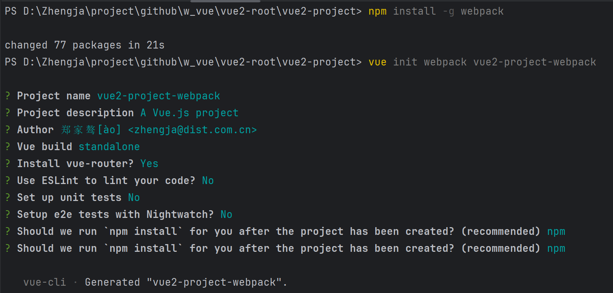

# vue3-root

- [vue2-英文-官网](https://v2.vuejs.org/)
- [vue2-中文-快速开始](https://v2.cn.vuejs.org/v2/guide/)
- [vue2-英文-快速开始](https://v2.vuejs.org/v2/guide/)

本项目是基于 **`vue2`** 框架集成各种前端组件示例。

## 目录结构

- [Vue2项目结构介绍.md](docs/Vue2项目结构介绍.md)

## 基础环境

- 确保你安装了最新版本的 [Node.js](https://nodejs.org/)

验证环境：

```shell
node -v
npm -v
```

本地环境验证示例：

```shell
# 本地采用的版本示例
node -v
v18.16.0
npm -v
9.5.1
```

## 快速开始

Vue2 创建项目有很多种方式，这里演示的分别是：

- 使用 Vue CLI 创建项目(提供命令行、图形界面创建项目)
- 使用 webpack 创建项目(提供命令行创建项目)

### 使用 Vue CLI 创建项目

Vue CLI 是官方推荐的脚手架工具，适合快速搭建 Vue 项目，适合大部分中小型项目。

#### 1.安装vue-cli

安装 Vue CLI：

```shell
# 安装 Vue CLI（如果尚未安装）
npm install -g @vue/cli
```

查看版本：

```shell
vue --version

@vue/cli 5.0.8
```

#### 创建项目

```shell
# 创建 Vue 2 项目
vue create vue2-project-vuecli

# 如果需要手动选择 Vue 2 版本，在创建时选择 "Manually select features" 并指定 Vue 版本

# 运行项目
cd vue2-project-vuecli
npm run serve
```

### 使用 webpack 创建项目

#### 全局安装

```shell
# 安装 Vue CLI（如果尚未安装）
npm install -g @vue/cli
npm install -g @vue/cli-init

# 安装 webpack（如果尚未安装）
npm install -g webpack
```

#### 创建项目

```shell
vue init webpack vue2-project-webpack
``` 

